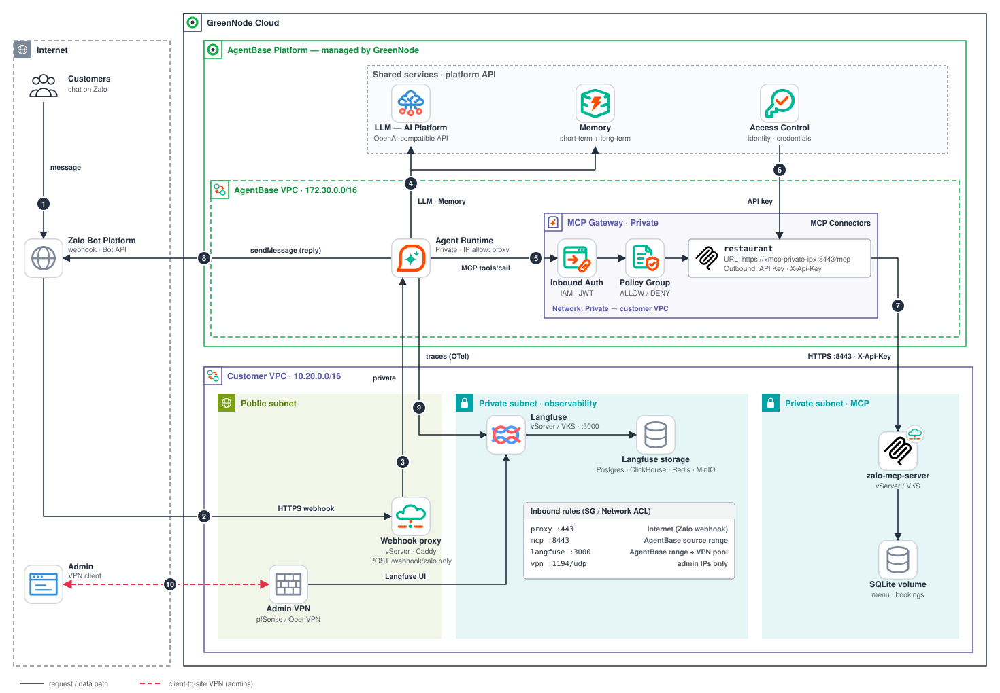

# Zalo Restaurant Bot — "Quán Ngon 123" (remembers returning guests)

[](https://github.com/GreenNode-Samples/sample-zalo-restaurant/actions/workflows/ci.yml)
[](LICENSE)

> An **end-to-end, production-style** sample on **GreenNode AgentBase**: the agent runs on **AgentBase Agent Runtime in Private mode**; the restaurant **MCP server** and a self-hosted **Langfuse** run **privately in the customer VPC**; tools are reached through a **Private MCP Gateway** (inbound IAM, Policy Group, API-key outbound auth); guests chat over the **Zalo Bot Platform** through a minimal public webhook proxy; admins reach Langfuse only through a **client-to-site VPN**. A **Web Simulator** is included for local development.



## Table of contents

- [The experience](#the-experience--the-restaurant-remembers-its-guests)
- [Architecture](#architecture)
- [Layout](#layout)
- [Deployment steps](#deployment-steps)
- [Security checklist](#security-checklist)
- [Troubleshooting](#troubleshooting)
- [Verify with GreenNode](#verify-with-greennode)
- [Local development](#local-development)
- [Env reference](#env-reference) · [LLM endpoint](#llm-endpoint-optional-sidecar-llm-proxy) · [API contract](#api-contract)
- [A2A protocol](#a2a-protocol-agent-to-agent) · [Observability](#observability--langfuse-v4-otel-sdk) · [Tests](#tests) · [Cost and teardown](#cost--teardown)

---

## Reference demo (earlier layout)

The sample was first demonstrated on a demo account with every component on AgentBase. Those endpoints may be taken down, and they do not follow the production layout described in [Architecture](#architecture).

| What | URL |
|---|---|
| Guest chat (real users) | **Zalo app** → search the bot *"Bot GreenNode AgentBase"* (no web UI on the demo endpoint — Zalo-first mode) |
| Zalo webhook (POST, secret-verified) | https://endpoint-00c922d6-7cc9-437b-95c3-121a7e744308.agentbase-runtime.aiplatform.vngcloud.vn/webhook/zalo |
| REST API | https://endpoint-00c922d6-7cc9-437b-95c3-121a7e744308.agentbase-runtime.aiplatform.vngcloud.vn/invocations |

---

## The experience — the restaurant *remembers* its guests

| Situation | What the bot does (automatically) |
|---|---|
| "I'm Hung, book a table tonight for 4, **no spicy food**" | Checks tables through **MCP** (`check_availability`) → suggests a table • `remember` "Hung, non-spicy" • confirms + `create_booking` |
| Returns later **via Zalo** (new session): "I'll come back this weekend" | *"Hi Hung! You sat at table T3 last time — the kitchen always cooks non-spicy for you"* — guest profile from the **CUSTOM memory strategy** |
| Unknown caller hits `/webhook/zalo` without the secret | **403 Denied** (`X-Bot-Api-Secret-Token` header) |

The **Web Simulator** (`GET /`): a Zalo-style UI (phone frame), add new guests, chat, plus a **Guest profile** panel and a **Current bookings** table (read live from the MCP server).

## Architecture

The request path for a guest message and the tool-call path:

```
Guest (Zalo app)
  -> Zalo Bot Platform  --HTTPS-->  webhook proxy (public subnet): only POST /webhook/zalo, TLS, size + rate limit
  -> Agent Runtime (AgentBase, Private mode)  ack 200 at once, LLM turn in a background thread
        |-- Memory (AgentBase)          guest profile, CUSTOM strategy "customer-profile"
        |-- LLM (GreenNode AIP)         direct, or the Sidecar LLM Proxy
        |-- Langfuse (customer VPC)     traces over the private network: http://<langfuse-private-ip>:3000
        `-- MCP Gateway (Private)  Inbound Auth: IAM
              -> Policy Group  (allow only the agent principal, only restaurant__* actions)
              -> connector `restaurant`  Outbound Auth: API Key (header X-Api-Key, secret in Access Control)
              -> MCP server (customer VPC, vServer or VKS) over HTTPS: https://<mcp-private-ip>:8443/mcp ; SQLite on a persistent volume
Reply path (outbound from the runtime, not through the proxy):
  Agent Runtime --HTTPS sendMessage--> Zalo Bot Platform (Internet)     needs outbound Internet egress (verify with GreenNode)
Admin laptop -> client-to-site VPN (pfSense OpenVPN) -> Langfuse UI on a private IP
```

The webhook proxy is **inbound only**. After the fast `200` ack, a background thread in the runtime calls `https://bot-api.zaloplatforms.com` (`ZALO_API_BASE`) directly to send the reply
(`sendMessage`; `getMe` for the bot name). The default LLM endpoint (`maas-llm-aiplatform-hcm.api.vngcloud.vn`) and the AgentBase Memory and IAM APIs are public hostnames as well, so a
Private-mode runtime needs **outbound Internet egress** for them too (the Sidecar LLM Proxy may cover the LLM path: verify). The documentation does not say whether a
Private runtime has egress: see [Verify with GreenNode](#verify-with-greennode) and the fallback in [`deploy/agent`](deploy/agent/README.md#5-outbound-egress).

> MCP flow: **Agent -> MCP Gateway (Inbound Auth IAM) -> Policy Group -> connector `restaurant` (Outbound Auth = API Key) -> MCP server**.
> The API key is stored in **Access Control** and attached by the gateway; the agent never sees it. LLM calls are a **separate path**
> (direct to LLM AIP here; on AgentBase Runtime they can also go through the *Sidecar LLM Proxy*, see
> [LLM endpoint](#llm-endpoint-optional-sidecar-llm-proxy)).

### What runs where

| Component | Runs on | Placement and network | Reachable from | Deploy guide |
|---|---|---|---|---|
| **Agent** (`src/backend`, root `Dockerfile`) | **AgentBase** Agent Runtime, only the agent image | **Private** mode: customer VPC + Subnet + Route CIDRs; calls out to Zalo, LLM and AgentBase APIs over HTTPS (egress: verify) | inbound: webhook proxy and admin range (IP Access Control) | [`deploy/agent`](deploy/agent/README.md) |
| **MCP Gateway** + Policy Group + connector `restaurant` | **AgentBase** (managed) | **Private** mode, attached to the customer VPC (DNS resolution on) | the agent (Inbound Auth IAM) | [Step 3](#deployment-steps) below |
| Memory, LLM | **AgentBase** / GreenNode AIP | managed | the agent | travel-buddy README steps 1 to 2 |
| **MCP server** (`src/mcp-server`) | **customer VPC, private subnet**: vServer (docker compose) or VKS | no public IP; SQLite on a named volume / PVC | only the gateway source range (`172.30.0.0/16`, or the VPC range if NAT'd; verify), over HTTPS (`:8443` on vServer) | [`deploy/mcp-server/vserver`](deploy/mcp-server/vserver/README.md) · [`deploy/mcp-server/vks`](deploy/mcp-server/vks/README.md) |
| **Langfuse v3** (web, worker, postgres, clickhouse, redis, minio) | **customer VPC, private subnet**: vServer (compose) or VKS (Helm) | bound to private IPs, **no public IP** | agent path and VPN client range, port 3000 only | [`deploy/langfuse/vserver`](deploy/langfuse/vserver/README.md) · [`deploy/langfuse/vks`](deploy/langfuse/vks/README.md) |
| **Webhook proxy** (Caddy, or vLB/ALB) | **customer VPC, public subnet**, public IP | exposes only `POST /webhook/zalo`; all else 404 | Zalo (Internet) | [`deploy/webhook-proxy`](deploy/webhook-proxy/README.md) |
| **VPN server** (pfSense OpenVPN) | **customer VPC, public subnet**, Floating IP | UDP 1194 (or TCP 443) | administrators | [`deploy/admin-vpn`](deploy/admin-vpn/README.md) |
| **Admin laptop** | via the VPN | OpenVPN client | opens `http://<langfuse-private-ip>:3000` | [`deploy/admin-vpn`](deploy/admin-vpn/README.md) |

The AgentBase VPC range is `172.30.0.0/16`. The customer VPC and any on-premises range **must not overlap** it. Private mode
needs the **AgentBase private connection** (VPC peering) to be activated for your VPC: ask GreenNode support.

### Components

- **`src/mcp-server`**: a FastMCP server (stateless HTTP) with 7 restaurant tools: `restaurant_info`, `get_menu`, `check_availability`,
  `create_booking`, `list_bookings`, `cancel_booking`, `get_loyalty`. It runs **in the customer VPC, not on AgentBase**.
  Authentication is **fail-closed**: `/mcp` requires an API key (`MCP_API_KEYS`, header `X-Api-Key` or `Authorization: Bearer`);
  with no key configured it answers `503`, with a wrong key `401`; `/health` stays open. Keys shorter than 32 characters or containing `<` / `>`
  (template placeholders) make the server refuse to start. Bookings and loyalty points are stored in
  **SQLite** (`MCP_DB_PATH`, `/app/data/restaurant.db` in the container) on a persistent volume, so restarts and redeploys keep the data.
  The image runs as a non-root user. Tool contract (details are in each tool's docstring):
  - **Guest identity**: `create_booking`, `list_bookings`, `cancel_booking` and `get_loyalty` take a `guest_id`, an opaque id (the Zalo user id) that the
    agent platform supplies, never the guest or the model. All guest data is keyed by it: a guest only ever sees and cancels their own bookings, and
    `customer` is just the display name printed on a booking.
  - **Loyalty**: points cannot be set by any tool. A booking earns 10 points on the server and cancelling it takes them back, so booking and cancelling repeatedly earns nothing.
  - **Validation**: `date` is ISO `YYYY-MM-DD` and not in the past (Asia/Ho_Chi_Minh), `time` is `HH:MM` between 10:00 and 21:00 (last seating; the restaurant closes at 22:00),
    party size 1 to 12, an explicit table must exist and seat the party. Constants (`OPENING_TIME`, `CLOSING_TIME`, `LAST_SEATING`, restaurant name, address and phone) are at the top of `main.py`.
  - **Slots**: a booking holds its table for 2 hours, so 19:00 and 19:30 on the same table conflict. The smallest free table that fits is chosen (numeric order: `T2` before `T10`).
    Booking the same guest, date and time twice returns the existing booking (`"created": false`) instead of a duplicate.
  - **Errors and output**: tools return JSON objects (MCP structured output); failures are MCP tool errors (`isError: true`) whose message says how to fix the call.
    `list_bookings` returns only upcoming bookings, at most 20, with a `truncated` flag.
  - A `restaurant.db` created by the earlier version of this sample (bookings keyed by name) is refused at startup: back it up and delete it.
- **`src/backend`**: LangGraph agent + Memory (1 **CUSTOM** strategy "customer-profile") + the Zalo webhook (**ack 200 immediately, LLM turn runs in a
  background thread**: Zalo never waits on the LLM; secret verification, retry dedupe, replies with `parse_mode=markdown` cut cleanly at the 2000-char limit).
  This is the **only** image deployed to AgentBase.
- **Webhook proxy**: because the runtime is Private, a small public reverse proxy in the VPC forwards only `POST /webhook/zalo` to the runtime's private endpoint.
  The app still verifies Zalo's `X-Bot-Api-Secret-Token`.
- **Policy Group** `zalo-gw-policy` (first match wins): the agent principal may call only the 7 `restaurant__*` actions; a `tools/call` matching no rule gets
  **403**. With **no** Policy Group attached, *every* `tools/call` is 403; `tools/list` bypasses policy.
- **Connector `restaurant`**: **Outbound Auth = API Key** (2LO, one shared key), header key `X-Api-Key`, **empty header value prefix**, secret provider
  `restaurant-mcp-key` in Access Control (value = the MCP server's `MCP_API_KEYS`). It replaces the former "No authorization" setting.
- **Langfuse (self-hosted, private)**: the agent exports traces over OpenTelemetry using the Langfuse SDK v4. The server must be a Langfuse v3.x release with
  OpenTelemetry ingestion (verify the version, see [Verify with GreenNode](#verify-with-greennode)). The UI is never public: admins connect through the VPN.

## Layout

```
├── src/mcp-server/        # main.py (FastMCP, 7 tools, API-key auth) · Dockerfile (non-root, /app/data volume) · requirements.txt
├── src/backend/           # main.py · agent.py · memory_tools.py · zalo.py · mcp_client.py   (the agent image)
├── src/frontend/          # simulator (index.html · style.css · app.js)
├── deploy/
│   ├── agent/             # build/push the agent image, create the Private runtime, env vars, security settings
│   ├── mcp-server/        # vserver/ (docker compose + Caddy TLS on :8443) · vks/ (Kubernetes manifests)
│   ├── langfuse/          # vserver/ (docker compose, Langfuse v3) · vks/ (official Helm chart values)
│   ├── webhook-proxy/     # Caddyfile + compose: public POST /webhook/zalo only (and the vLB/ALB alternative)
│   ├── admin-vpn/         # client-to-site VPN (pfSense OpenVPN) for admins
│   └── check_connectivity.sh   # run from a vServer in the VPC
├── docs/architecture.svg
├── Dockerfile · docker-compose.yml (local development) · .env.example
```

## Deployment steps

Do the steps in this order. Portal: **https://aiplatform.console.vngcloud.vn** (AgentBase) and the vServer / VKS consoles for the VPC resources.
The LLM key and Memory (Steps 1 to 2 of the [sample-travel-buddy](../sample-travel-buddy) README) are created the same way; here the memory has one CUSTOM strategy
named `customer-profile`.

0. **Prerequisites and CIDR plan.**
   - Ask GreenNode support to **activate the AgentBase private connection** for your VPC (required for Private runtimes and gateways).
   - Choose non-overlapping ranges: customer VPC (for example `10.20.0.0/16`), VPN tunnel network (for example `10.8.0.0/24`), and nothing inside `172.30.0.0/16`.
   - Create subnets: a **private** subnet (MCP server, Langfuse, agent runtime) and a **public** subnet (webhook proxy, pfSense). Enable **DNS resolution** on the VPC.
1. **LLM key and Memory** (`AGENTBASE_MEMORY_ID`, `MEMORY_STRATEGY_ID`): as in the travel-buddy README.
2. **MCP server in the customer VPC**: [`deploy/mcp-server/vserver`](deploy/mcp-server/vserver/README.md) (docker compose) **or**
   [`deploy/mcp-server/vks`](deploy/mcp-server/vks/README.md) (Kubernetes). Generate `MCP_API_KEYS` (`openssl rand -hex 32`) and record it. Expose it over **HTTPS** (Caddy TLS on `:8443` for vServer; LB / ingress TLS for VKS). Security group:
   the HTTPS port only from the gateway source (`172.30.0.0/16`, or the VPC range if NAT'd: verify). Test with `deploy/check_connectivity.sh`.
3. **Private MCP Gateway, connector and policy.**
   1. **Access Control**: create an **API Key** provider `restaurant-mcp-key` whose value is exactly the MCP server key.
   2. **MCP Governance > MCP Gateway > Create Gateway**: name `zalo-private-gw`, **Inbound Auth = IAM Permissions**, **Network mode = Private** (the customer VPC and the Subnet of the MCP server;
      DNS resolution on; the network mode cannot be changed afterwards: assumed, verify).
   3. **Add Custom Connector**: Name `restaurant`, Type `MCP`.
      - **Endpoint**: `https://<mcp-private-ip>:8443/mcp` (vServer with Caddy TLS) or `https://<internal-lb-ip>:<port>/mcp` (VKS, TLS terminated at the internal LB / ingress).
        The docs describe a full HTTPS URL; plain `http://<ip>:8080/mcp` is an unverified alternative only.
      - **Outbound Auth = API Key**, mode **2LO**, provider `restaurant-mcp-key`, **Header key `X-Api-Key`**, **Header value prefix empty** (the default `Bearer ` would break the key).

      API form (`targets` is a **full replacement**: include every existing connector):

      ```json
      {"targets": [{"name": "restaurant", "type": "MCP", "endpoint": "https://<mcp-private-ip>:8443/mcp",
        "outboundAuth": {"type": "APIKEY", "flow": "2LO", "headerName": "X-Api-Key",
                         "headerValuePrefix": "", "providerName": "restaurant-mcp-key"}}]}
      ```
   4. Copy the gateway **Endpoint URL**: the agent's `MCP_RESTAURANT_URL` is `<gateway-endpoint-url>/restaurant`.
   5. **Policy Group** `zalo-gw-policy` (attach it to the gateway; without it every `tools/call` is 403). After the agent runtime exists, read its principal with
      `{"op":"whoami"}` (`DEBUG_OPS=1`, then turn it off again) and add:

      ```json
      {"effect": "allow", "principal": "iam:<runtime-token_sub>", "resources": ["gateway:zalo-private-gw"],
       "actions": ["restaurant__restaurant_info", "restaurant__get_menu", "restaurant__check_availability",
                   "restaurant__create_booking", "restaurant__list_bookings", "restaurant__cancel_booking",
                   "restaurant__get_loyalty"]}
      ```
4. **Langfuse (private)**: [`deploy/langfuse/vserver`](deploy/langfuse/vserver/README.md) (compose) **or** [`deploy/langfuse/vks`](deploy/langfuse/vks/README.md) (Helm). Bind to private IPs;
   security group port 3000 only from the agent path and the VPN client range.
5. **Admin VPN**: [`deploy/admin-vpn`](deploy/admin-vpn/README.md). Connect, open `http://<langfuse-private-ip>:3000`, create the project and **API keys**, disable sign-up.
6. **Agent runtime (Private mode)**: [`deploy/agent`](deploy/agent/README.md). Build and push the image, create the runtime with VPC, Subnet and Route CIDRs, set the env vars
   (`MCP_RESTAURANT_URL`, `LANGFUSE_*`, `ZALO_*`, `LLM_*`, memory ids, `SERVE_UI=false`), configure **Security Settings** (IP Access Control for the proxy source), and confirm **outbound egress** to `bot-api.zaloplatforms.com` and the other HTTPS destinations (see [Outbound (egress)](deploy/agent/README.md#5-outbound-egress)).
7. **Webhook proxy and Zalo**: [`deploy/webhook-proxy`](deploy/webhook-proxy/README.md). Deploy the proxy in the public subnet, register
   `https://<webhook-domain>/webhook/zalo` with `setWebhook`, with the same `ZALO_WEBHOOK_SECRET` as on the runtime. Create the bot at **https://bot.zaloplatforms.com**
   ([create-bot](https://bot.zaloplatforms.com/docs/create-bot/)); you receive a Bot Token `<id>:<secret>`.
8. **Verify end to end.** From a vServer in the VPC:

   ```bash
   MCP_HOST=<mcp-private-ip> MCP_API_KEY=<key> INSECURE=1 \
   LANGFUSE_URL=http://<langfuse-private-ip>:3000 RUNTIME_URL=http://<runtime-private-endpoint> \
   PROXY_URL=https://<webhook-domain> ./deploy/check_connectivity.sh
   ```

   With `RUNTIME_URL` the script also calls the runtime's `GET /ready`, which checks Memory, the gateway path and the Zalo `getMe` call (a proof of outbound egress). Then message the bot in Zalo: a reply arrives, a booking is created, a trace appears in Langfuse. Zalo notes: only `event_name = message.text.received` is handled;
   image, sticker and voice events are safely ignored; `getWebhookInfo` re-checks the configuration and `testWebhook` tests it.

## Security checklist

- [ ] The customer VPC and on-premises ranges do **not overlap** `172.30.0.0/16`.
- [ ] **MCP server**: no public IP; the port is open only to the gateway source range; `MCP_API_KEYS` set (fail-closed: `503` without a key); `ALLOW_ANONYMOUS` is **not** set; volume backed up.
- [ ] **Connector** `restaurant`: Outbound Auth = **API Key**, header `X-Api-Key`, empty prefix; the secret exists only in Access Control and the server; rotation tested (two keys at once).
- [ ] **Gateway**: Inbound Auth = IAM Permissions (not "No authorization"); a Policy Group is attached and allows only the agent principal and only the 7 `restaurant__*` actions.
- [ ] **Langfuse**: private IP only, **no Floating IP**; port 3000 only from the agent path and the VPN client range; strong generated secrets; sign-up disabled; backups tested.
- [ ] **Admin VPN**: one certificate per admin, MFA where available, firewall rule limited to Langfuse `3000`, pfSense GUI not exposed.
- [ ] **Webhook proxy**: only `POST /webhook/zalo` forwarded (everything else 404), TLS, `MAX_BODY` and `RATE_EVENTS` set; ports 443 (and 80 for ACME) only.
- [ ] **Agent runtime**: Private mode; outbound egress to `bot-api.zaloplatforms.com` confirmed (or a forward proxy limited to that host); IP Access Control restricted to the proxy source; `ZALO_WEBHOOK_SECRET` set; `SERVE_UI=false`; `DEBUG_OPS=0`; `AGENT_API_KEY` set; secrets handled as described in [`deploy/agent`](deploy/agent/README.md#secrets).
- [ ] `deploy/check_connectivity.sh` passes from a vServer in the VPC; no component other than the proxy and the VPN server has a public address.

## Troubleshooting

| Symptom | Likely cause | What to check |
|---|---|---|
| Private VPC not listed when creating the runtime or gateway | AgentBase private connection not activated for that VPC | Ask GreenNode support to activate it |
| Gateway `5xx` on `tools/call` | Gateway cannot reach the MCP server | Security group source range (gateway `172.30.0.0/16` or NAT'd), route table, MCP port, scheme (HTTP vs HTTPS), connector URL ends with `/mcp` |
| `401` from the MCP server | API key mismatch, header key not `X-Api-Key`, or prefix left as `Bearer ` | Access Control value vs `MCP_API_KEYS`; connector header settings; `docker compose logs mcp` shows `401 on /mcp from <ip>` |
| `503` from the MCP server | `MCP_API_KEYS` not set (fail-closed) | Set the key and restart |
| `403` on `tools/call`, `tools/list` works | No Policy Group attached, or the principal or `restaurant__<tool>` action is not allowed | Gateway **Policy** tab (changes apply in about 30 seconds); principal from `whoami` |
| `401` from the gateway endpoint | Inbound IAM auth failed (the agent's token) | Runtime identity and `GREENNODE_CLIENT_*`; `MCP_RESTAURANT_URL` must be the gateway URL plus `/restaurant` |
| `404` or `Session terminated` from MCP | Wrong path | Gateway URL must end with the connector name; the connector URL must end with `/mcp` |
| Webhook returns `404` | Wrong URL or method; the proxy exposes only `POST /webhook/zalo` | The registered URL ends with `/webhook/zalo`; `check_connectivity.sh` with `PROXY_URL` |
| Webhook accepted (`200`) but the guest never gets a reply; runtime log shows `sent=False` (`ConnectError` or timeout) | The Private runtime cannot reach `bot-api.zaloplatforms.com` (no outbound egress) | `GET /ready` (`zalo.bot` empty); [`deploy/agent`](deploy/agent/README.md#5-outbound-egress) and the forward-proxy fallback; ask GreenNode |
| Webhook `502/503/504` from the proxy | Proxy cannot reach the runtime private endpoint | `RUNTIME_UPSTREAM`, runtime status, routes and security groups, Host header (verify with GreenNode) |
| Webhook `403` | Wrong or missing Zalo secret | Same `ZALO_WEBHOOK_SECRET` on the runtime and in `setWebhook` |
| Webhook `429` / `413` | Proxy rate limit or request size limit | `RATE_EVENTS`, `MAX_BODY` in `deploy/webhook-proxy/.env` |
| No traces in Langfuse | `LANGFUSE_*` incomplete, security group blocks 3000 from the agent path, wrong host, server version too old for OpenTelemetry | Runtime env; Langfuse web logs; `curl http://<ip>:3000/api/public/health` |
| Cannot open the Langfuse UI | VPN not connected, missing route to the tunnel network, `NEXTAUTH_URL` mismatch | [`deploy/admin-vpn`](deploy/admin-vpn/README.md) troubleshooting |
| Bookings lost after redeploy | SQLite not on the persistent volume | `/app/data` must be the volume or PVC; `MCP_DB_PATH=/app/data/restaurant.db`; do not run `docker compose down -v` |

## Verify with GreenNode

These points are **not stated in the public documentation** used for this sample. Confirm them with GreenNode before production use:

1. **Private runtime endpoint**: whether a Private-mode runtime still exposes a **public endpoint**, and the exact **private endpoint hostname or IP**, scheme and port that the webhook proxy forwards to (`RUNTIME_UPSTREAM`).
2. **Private runtime outbound Internet egress**: the runtime sends the Zalo reply itself (`https://bot-api.zaloplatforms.com`) and calls the LLM, Memory and IAM APIs over HTTPS. The docs only say Private is not exposed to the public internet (inbound) and that Route CIDRs reach customer subnets. If there is no egress, use the forward-proxy fallback in [`deploy/agent`](deploy/agent/README.md#5-outbound-egress) (documented, not implemented here).
3. **Source addresses**: what source address the **runtime** sees from the proxy (for IP Access Control), and whether the **gateway** reaches the MCP server as `172.30.0.0/16` or source-NATed to a VPC address (security groups, NetworkPolicy).
4. **Route CIDRs**: which routes the runtime needs to reach the gateway endpoint and Langfuse, and whether the route to the VPC is added automatically once the private connection is active.
5. **Secrets**: whether Access Control secrets can be referenced from a runtime's environment (the docs say environment variables are for non-sensitive configuration).
6. **Inbound Identity** on a runtime that must accept Zalo: whether specific paths (`/webhook/zalo`) can be exempt from IAM/JWT.
7. **Connector endpoint**: whether `http://` is accepted (the docs describe a full HTTPS URL), and how an internal or custom CA is provided for TLS.
8. **Gateway network mode** is fixed after creation (assumed), and which network mode the calling runtime needs to reach a Private gateway endpoint.
9. **Internal load balancer** annotation for VKS Services (and an internal ALB option for Ingress): not in the public VKS docs reviewed.
10. **ALB as the webhook ingress**: private endpoint as a pool member, a default `404` or reject action, method matching, request size and rate limits.
11. **VPN**: whether a VPC route can target the pfSense address as next hop and which NIC settings pfSense needs; any managed client VPN offering.
12. **Policy principal**: the exact `iam:<id>` value for an agent runtime on your gateway version.
13. **Langfuse version**: the minimum Langfuse server version the SDK v4 requires for OpenTelemetry ingestion (`/api/public/otel`), and whether v3.x satisfies it. Upstream `main` now ships v4 images.
14. **Network ACL** interplay with the private connection and VPN traffic (rules are stateless and evaluated before the security group).
15. **Sidecar LLM Proxy**: auth requirements and model names for your runtime version (`LLM_BASE_URL=http://localhost:18080`).

## Local development

Run the agent and the MCP server on your machine with docker compose (no gateway, no VPN, no public ingress):

```bash
cp .env.example .env     # fill LLM_*, memory ids, GREENNODE_CLIENT_ID / GREENNODE_CLIENT_SECRET (needed locally only)
docker compose up --build
# open http://localhost:8080  (Web Simulator, SERVE_UI=true)
```

`docker-compose.yml` starts `mcp-server` (with `ALLOW_ANONYMOUS=true`, local use only, SQLite in a named volume) and `agent` with
`MCP_RESTAURANT_URL=http://mcp-server:8080/mcp`. For local traces run the upstream Langfuse compose separately
(https://github.com/langfuse/langfuse, folder root `docker-compose.yml`) and set `LANGFUSE_HOST=http://host.docker.internal:3000` and the two keys in `.env`; leave them empty to disable tracing.
The simulator works 100% without a Zalo token (the UI shows `zalo_configured=false`).

## Env reference

| Variable | Required | Meaning |
|---|---|---|
| `LLM_API_KEY` · `LLM_MODEL` | Yes | LLM AIP |
| `LLM_BASE_URL` | optional | OpenAI-compatible endpoint, default LLM AIP `https://maas-llm-aiplatform-hcm.api.vngcloud.vn/v1`. On AgentBase Runtime may point to the Sidecar LLM Proxy `http://localhost:18080` (verify with GreenNode) |
| `AGENTBASE_MEMORY_ID` | Yes | `memory-…` (create as in the travel repo Step 2, with **one CUSTOM strategy** named `customer-profile`, prompt: *"Extract the restaurant guest profile: name, phone, food preferences (vegetarian/spicy/allergies), usual table, birthday, visit history."*) |
| `MEMORY_STRATEGY_ID` | Yes | that strategy's `ltms-…` ID |
| `MCP_RESTAURANT_URL` | Yes | connector URL of the **Private gateway**: `<gateway-endpoint-url>/restaurant` (local development: `http://mcp-server:8080/mcp`) |
| `ZALO_BOT_TOKEN` | optional | enables the real Zalo mode |
| `ZALO_WEBHOOK_SECRET` | recommended | verifies the `X-Bot-Api-Secret-Token` header |
| `ZALO_API_BASE` | default | `https://bot-api.zaloplatforms.com` |
| `SERVE_UI` | default `true` | `false` → disable the Web Simulator on the endpoint (Zalo-first mode) |
| `AGENT_API_KEY` | optional | if set, `/invocations` + `/api/*` require the `X-API-Key` header (the webhook uses its own Zalo secret and is never blocked) |
| `DEBUG_OPS` | default `0` | `1` enables the `{"op":"whoami"}` identity op — only while setting up policies |
| `LANGFUSE_HOST` | for traces | self-hosted Langfuse over the private network: `http://<langfuse-private-ip>:3000` |
| `LANGFUSE_PUBLIC_KEY` · `LANGFUSE_SECRET_KEY` | for traces | project API keys from the private Langfuse (tracing is disabled unless all three `LANGFUSE_*` are set) |

MCP server variables (set on the vServer / VKS, **not** on the AgentBase runtime):

| Variable | Required | Meaning |
|---|---|---|
| `MCP_API_KEYS` | Yes | comma-separated API key(s) accepted on `/mcp` (`X-Api-Key` or `Authorization: Bearer`); generate with `openssl rand -hex 32`; each key needs 32+ characters and no `<` / `>` or the server refuses to start; unset = `503` (fail-closed) |
| `ALLOW_ANONYMOUS` | local only | `true` lets `/mcp` run without a key when `MCP_API_KEYS` is empty |
| `PORT` | default `8080` | listen port |
| `MCP_DB_PATH` | default `data/restaurant.db` (`/app/data/restaurant.db` in the image) | SQLite path (bookings/loyalty persistence); keep it on the persistent volume |

Secrets (`LLM_API_KEY`, `LANGFUSE_SECRET_KEY`, `ZALO_BOT_TOKEN`, `ZALO_WEBHOOK_SECRET`, `AGENT_API_KEY`): see [`deploy/agent`](deploy/agent/README.md#secrets).

## LLM endpoint (optional: Sidecar LLM Proxy)

By default the agent calls the LLM directly: `ChatOpenAI(base_url=LLM_BASE_URL, api_key=LLM_API_KEY)` with `LLM_BASE_URL=https://maas-llm-aiplatform-hcm.api.vngcloud.vn/v1`. This sample does **not** change that default.

Per the AgentBase docs, LLM calls on a Runtime go through a **Sidecar LLM Proxy** that is auto-injected when the agent is created (endpoint `localhost:18080` in the agent config) — a path **separate from the MCP Gateway**. To try it on a Runtime, set `LLM_BASE_URL=http://localhost:18080`. *Verify with GreenNode for your runtime version* (auth requirements and model names are not covered here) before relying on it.

## API contract

| Method | Path | Description |
|---|---|---|
| POST | `/invocations` | simulator/REST chat · headers `X-GreenNode-AgentBase-User-Id` (→ memory `actorId`) + `-Session-Id` (→ `thread_id`) are **required** — missing → `400`, no defaults (the Runtime sets them on real traffic) · `{"op":"whoami"}` |
| POST | `/a2a` | A2A JSON-RPC; requires `X-GreenNode-AgentBase-User-Id` (missing → `400`) |
| POST | `/webhook/zalo` | Zalo Bot Platform webhook (secret verification, `message_id` dedupe) |
| GET | `/webhook/zalo?challenge=` | manual check |
| GET | `/api/memory?actor=` · `/api/history` · `/api/actors` | guest profile · conversation · known guests |
| GET | `/api/bookings` | calls the MCP `list_bookings` tool directly |
| GET | `/api/info` · `/health` | config (includes `zalo_configured`, bot name) |
| GET | `/ready` | deep readiness: memory + gateway + LLM + Zalo (200 ok / 503 degraded) |

## Verified end-to-end (reference demo)

- Hung (no-spicy) → table T3 · Lan (vegetarian, 6 guests, T7) → booking created; a new session later → the bot recalls the profile exactly.
- Webhook: correct secret → processed + replied (`sent` reflects a real Zalo send); wrong secret → **403**; `setWebhook` returned `verification.ok = true`.
- Policy Group: an unknown token calling the gateway → 403 *"Request denied by policy."*
- Tools worked through the gateway on the demo account (its connector used No authorization; the layout in this README uses an API Key). These checks were made on the earlier all-on-AgentBase demo layout. The Private / VPC layout is documented here and its pieces (MCP server auth and persistence, webhook proxy, compose files, Helm values) were exercised individually in local tests, but the full private path depends on the GreenNode items listed in [Verify with GreenNode](#verify-with-greennode).

## A2A protocol (agent-to-agent)

This agent is an **A2A server** (message/send; no streaming):

| Endpoint | Method | Description |
|---|---|---|
| `/.well-known/agent-card.json` | GET | Agent card: name, skill `restaurant-consultation`, capabilities (streaming: no) |
| `/a2a` | POST | JSON-RPC 2.0 `message/send` → standard A2A `Message` (contextId + text parts) |

- A2A reuses the same `_chat_turn` as chat and the webhook, so A2A conversations **have guest memory** just like regular Zalo conversations.
- `POST /a2a` **requires** the `X-GreenNode-AgentBase-User-Id` header (→ memory `actorId`; missing → 400, there is no shared default `a2a` actor). Through AgentBase Runtime the header is attached automatically; when calling directly, send it yourself. If `contextId` is missing, the `X-GreenNode-AgentBase-Session-Id` header is used, and only then a newly generated id.
- Quick test (the sample message is Vietnamese: "What time does the restaurant close?"):
  ```bash
  curl -s -X POST $ENDPOINT/a2a -H 'Content-Type: application/json' -H 'X-GreenNode-AgentBase-User-Id: guest-1' -d \
    '{"jsonrpc":"2.0","id":"1","method":"message/send","params":{"message":{"kind":"message","messageId":"m1","role":"user","parts":[{"kind":"text","text":"Quán mở cửa đến mấy giờ?"}]}}}' | jq -r '.result.parts[0].text'
  ```
- Unit tests: `tests/test_a2a.py`, `tests/test_memory_headers.py`.

## Observability — Langfuse v4 (OTel SDK)

Every turn (chat + webhook + A2A) is traced with the **Langfuse Python SDK v4** (`langfuse>=4.0,<5`): `_lf_scope()` (`propagate_attributes`) wraps `_chat_turn`, so the trace name/user/session/tags apply to the root and every child observation; `_lf_callback()` is created inside that scope. Enable it with 3 env vars: `LANGFUSE_PUBLIC_KEY`, `LANGFUSE_SECRET_KEY`, `LANGFUSE_HOST`; if any are missing, tracing is disabled automatically. The Langfuse UI shows the model and token usage for each generation, tool calls (`recall`), and session/user/tags.

In this deployment Langfuse is **self-hosted and private** in the customer VPC ([`deploy/langfuse`](deploy/langfuse/vserver/README.md)): the agent sends traces to `LANGFUSE_HOST=http://<langfuse-private-ip>:3000` over the private network, and admins open the UI only through the [client-to-site VPN](deploy/admin-vpn/README.md). The server must be a Langfuse v3.x release with OpenTelemetry ingestion (verify the version against the SDK's requirements).

## Production hardening

| Guard | How |
|---|---|
| **Private network** | the runtime and the gateway run in **Private** mode in the customer VPC; the MCP server and Langfuse have no public IP; only the webhook proxy and the VPN server are internet-facing |
| **Runtime Security Settings** | in the Portal runtime's *Security Settings*: **IP Access Control** (allowed source CIDRs; empty = allow all): allow only the webhook proxy source. **Inbound Identity** (IAM Permissions or JWT): Zalo's webhook calls carry no GreenNode token, so enforcing it on the whole runtime blocks the webhook; unless GreenNode confirms a path exemption use IP Access Control + the Zalo secret (see [Verify with GreenNode](#verify-with-greennode)) |
| **Webhook proxy** | exposes only `POST /webhook/zalo`; everything else `404`; TLS, request size limit, per-IP rate limit ([`deploy/webhook-proxy`](deploy/webhook-proxy/README.md)) |
| **MCP server auth** | fail-closed API key on `/mcp` (`MCP_API_KEYS`, `401` / `503`); only the gateway source range may reach the port; non-root container |
| **Memory headers validated** | `X-GreenNode-AgentBase-User-Id` / `-Session-Id` are required on `/invocations` and `X-GreenNode-AgentBase-User-Id` on `/a2a` → `400` if missing (no silent defaults → no cross-guest memory mixing). The Zalo webhook derives actor/session from Zalo's `sender_id` / `chat_id` |
| **Fast webhook ack** | the webhook returns `200` instantly and processes the LLM turn in a background thread — Zalo never times out or retries while the LLM is thinking |
| **Retry-safe dedupe** | `message_id` is marked seen *before* processing, so a Zalo retry during a slow turn is still dropped |
| **Zalo secret** | `X-Bot-Api-Secret-Token` is verified on every event; wrong secret → `403` |
| **Zalo-first mode** | `SERVE_UI=false` disables the web simulator on the endpoint — guests interact only in Zalo |
| **API key on REST** | set `AGENT_API_KEY` → `/invocations` + `/api/*` require `X-API-Key` (the webhook is exempt — it has its own secret) |
| **Hide runtime identity** | keep `DEBUG_OPS=0` (default) — `whoami` is disabled after policy setup |
| **Policy Group on the gateway** | only this runtime's principal may call `restaurant__*` (first match wins; no match → 403) |
| **Private observability** | Langfuse is reachable only on private IPs and through the VPN |
| **Data persistence** | the MCP server stores bookings/loyalty in SQLite on a persistent volume / PVC — restarts and redeploys keep data; back it up |
| **Clean 2000-char replies** | long replies are cut at paragraph/line boundaries (never mid-markdown) with a "(…còn tiếp)" note (Vietnamese for "to be continued") |
| **Context budget** | history trimmed to the last 40 messages; gateway calls retry with backoff; `recall` degrades gracefully |

## Tests

```bash
pip install -r src/backend/requirements.txt -r src/mcp-server/requirements.txt pytest
pytest -q                                   # unit tests: MCP server tools + API-key auth, Zalo, A2A, memory headers
bash -n deploy/check_connectivity.sh        # script syntax
```

The MCP server tests use a temporary SQLite database per test and cover the fail-closed authentication (`503` without a key, `401` for a wrong key, both header styles, `/health` open).

## Cost & teardown

- **AgentBase**: 1 runtime (the agent, 1 replica × 2x4) + the Private MCP Gateway (flavor × replicas) + Memory + LLM usage.
- **Customer VPC**: vServer(s) or a VKS cluster for the MCP server and Langfuse (Langfuse alone is sized around 4 vCPU / 16 GiB: verify), a small vServer with a public IP for the webhook proxy, the pfSense vServer, volumes and an optional load balancer.
- Teardown: delete the runtime, the `restaurant` connector (and the gateway), the Access Control API key provider, memory and the LLM key; then stop the proxy, VPN, Langfuse and MCP server and delete their volumes only after backing up what you need
  (`docker compose down -v` and `kubectl delete namespace` delete the data) — or use the `agentbase-teardown` skill for the AgentBase side.
